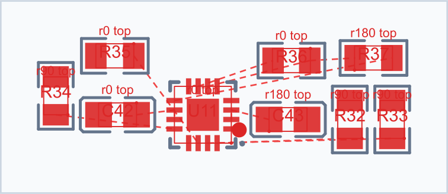
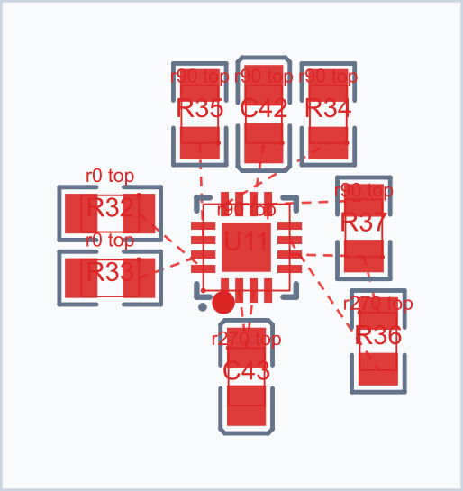

# Эксперименты локальной PCB-расстановки

Ветка: `experiments/block-placement-quality`. Исходный backend: `38d3a8c`, 0.3.5.

Результат: улучшение обвязки USB подтверждено на локальном решателе, но универсального победителя для трёх полных плат нет. Экспериментальные алгоритмы сохранены как **opt-in** в native DTO; production defaults и назначение postrefine не изменены. Это исследовательская ветка, не предложение сразу выпустить все флаги в релиз.

## Стенды и воспроизводимость

- Telemetry: 154 компонента, текущий DSL из `telemetry-design/pcb-placement-placer.js`, включая criticalPair для C42/C43. Это новый baseline, а не точное воспроизведение исторического pass-4 без этих отношений.
- ESpower: 53 компонента, существующий fixture `tests/pcb-layout/ESpower`.
- ESP32C3: 20 компонентов, существующий fixture `tests/pcb-layout/esp32c3`.
- В `tests/fixtures/block-placement` сохранены resolved PlacementInput (footprints, nets, board, constraints) и 80 native входов/выходов исходных прогонов. Последующие прогоны полностью локальны, EasyEDA и сетевое разрешение footprints не требуются.
- Контур Telemetry получен из сохранённого обзора PCB с тем же преобразованием y-up → y-down и центрированием, которое использует extension. DSL сохраняет только board; механические позиции берутся из DSL. Не воспроизводим медь текущей PCB: задача — placement, не routing.
- Изолированные сравнения ограничены 17 обычными многокомпонентными native задачами: один blockName, до 12 primitives. Многие маленькие группы решаются другим passive-island solver; singleton и объединённые satellite-family задачи не включены в итоговую локальную матрицу. Полные платы проверяют влияние изменённых блоков на эти семейства и board packing.
- Объединённые family-задачи пробовались в предварительном запуске; широкий beam на них оказался слишком дорогим. Этот неполный запуск не включён в итоговые 561 локальных измерений.

## Проверенные изменения

| Код | Изменение |
|---|---|
| B0 | Исходный алгоритм |
| N | Кандидаты возле связанных площадок обычного net; повороты, четыре стороны, три сдвига, до четырёх anchors на площадку |
| W4/W8/W16 | Beam 4/8/16 |
| S | Классификация small-block для веса связей из полного состава блока, без скачка на пятом шаге |
| C1 | Вес hull area ×0.25 |
| C2 | Дополнительный плавный aspect penalty после 2:1; исходный после 5:1 сохранён |
| L | Квадратичный штраф избыточной длины двухточечных локальных nets, нормированный размерами компонентов |
| P | До восьми одиночных проходов local_improve |
| X | Один проход парных обменов с допустимыми поворотами |
| R | Удаление пары и повторная вставка в обоих порядках, локальный beam 2 |
| ALL | N + W4 + S + C1 + C2 + L |
| ALLP/ALLX/ALLR | ALL плюс соответствующий neighbourhood |
| NCL | N + C1 + L, без beam и aspect penalty |
| NCLP/NCLX/NCLR | NCL плюс соответствующий neighbourhood |
| NCLW | NCL + W4 с сохранением dense-IC access penalty |

Дополнительно: W4A сохраняет dense-IC access penalty при beam. В исходнике searchWidth > 1 отключает этот штраф, поэтому обычное W-сравнение не является чистой сменой ширины. Для USB W4A дал те же геометрические метрики, что W4; этим отдельно проверено, что эффект на USB не объясняется только отключением штрафа доступа.

Для ALL сделана абляция: поочерёдное отключение N, W, S, C1, C2, L. В этой комбинации каждое отключение увеличило сумму двухточечных соединений USB. Это подтверждает совместный эффект, но не доказывает пользу каждого флага на произвольной плате.

Для N и L во второй серии учитываются ignoredNets из исходного solver input, сравнение без учёта регистра. Первая серия не имела этого поля; её native SHA сохранён отдельно. Все сравнения всегда выполняются с собственной контрольной строкой B0. Ground, пустые nets и внутренние связи одного primitive не используются как новые притягивающие пары. Схемные паттерны не распознаются.

## USB: локальный результат

Метрики рассчитаны по преобразованным координатам площадок, независимо от оптимизируемого score. Здесь «сумма» — сумма евклидовых длин двухточечных негрунтовых nets между разными primitives; не сумма всех пар многоточечной шины.

| Вариант | Сумма, мм | Худшая связь, мм | Bbox, мм² |
|---|---:|---:|---:|
| B0 | 44.64 | 11.68 | 122.37 |
| N | 44.30 | 11.65 | 120.24 |
| L | 32.68 | 7.16 | 124.01 |
| ALLX | 21.62 | 5.43 | 157.39 |
| NCLR | 33.05 | 7.02 | 139.59 |

ALLX: сумма −51.6%, худшая связь −53.5%, bbox +28.6%. Геометрических hard violations у этих USB решений нет. Обвязка действительно распределилась вокруг IC. Это локальный выигрыш с увеличением размера блока.

Исходный локальный блок:



ALLX:



Картинки имеют одинаковый масштаб исходного renderer; Markdown-просмотрщик может автоматически уменьшить широкую картинку.

## Полная плата меняет вывод

См. [полную таблицу](board-results.md), [машиночитаемые измерения](measurements.json).

- Telemetry B0: сумма двухточечных связей всей платы 781.84 мм; ALLX: 932.66 мм (+19.3%). HPWL также вырос: 2716.39 → 2905.82 мм. Локально более удачный USB не означает улучшение всей платы.
- Telemetry N: худшая связь всей платы уменьшилась 63.08 → 60.64 мм, но сумма выросла 781.84 → 790.97 мм. Это компромисс, а не однозначный провал N.
- ESpower ALLR: сумма 95.23 → 89.13 мм, HPWL 435.51 → 431.50 мм. Однако ограниченная маршрутная проба увеличила число vias с 6 до 16, поэтому только по длинам этот вариант принимать нельзя.
- ESP32C3: N и L сохраняют исходные итоговые метрики; beam-комбинации преимущественно ухудшают их. Этот стенд полезен как контроль отсутствия универсального выигрыша.

Полные прогоны сохраняют 01-tree, 02-legalize, 03-post-place, 04-final. Название `block/*.svg` само по себе не обозначает стадию: обычный debug renderer вырезает блок из итоговой расстановки. Native capture позволяет отдельно увидеть результат именно block solver. Постобработчик платы не менялся.

## Маршрутная проверка

Использован существующий paired micro-route comparison с одним baseline и одинаковым набором changed designators. Отчёт содержит количество jobs, Found/NoPath/BudgetExhausted, штраф, длины найденных путей и vias. Он ограничен бюджетом: Telemetry — 32 задания, ESpower — 27, ESP32C3 — 22. Это не полная трассировка платы и не проверка меди текущего EasyEDA-документа.

На Telemetry ALLX route penalty уменьшился относительно B0 при одинаковом количестве незавершённых заданий. Таким образом, длины всей платы и маршрутная проба оценивают компромисс по-разному. BudgetExhausted нигде не интерпретируется как доказанная непроходимость. Модель микро роутера двухслойная, она не доказывает качество предполагаемой четырёхслойной реализации.

## Выводы по local_improve

- Просто добавить проходы почти бесполезно на USB baseline: результат не меняется.
- Парные обмены могут улучшить худшую связь, но сами по себе не гарантируют сокращения суммы.
- Повторная вставка пары иногда улучшает геометрию и соединения, но заметно дороже; на части других блоков/плат есть регрессии.
- Лучший USB получен сочетанием генерации, поиска и оценки. Нельзя приписать весь эффект одному новому neighbourhood.

## Ограничения и решение

Все флаги по умолчанию false. Нет автоматического выбора победителя, новых production presets, изменения пострефайна или применения расстановки в EasyEDA. Отдельный branch-local DTO явно включает исследовательские параметры в native input, поэтому разные эксперименты не сталкиваются в solve-cache.

Не реализованы в этой серии: распознавание схемных паттернов (отложено пользователем), beam-diversity/квоты shortlist, альтернативные формы блока на уровне board packer, переопределение роли микро роутера. Результаты дают основание следующим шагом сохранять несколько локальных вариантов блока и сравнивать их уже в контексте всей платы. Это направление, а не доказанное улучшение.

Общее время в таблице — exploratory single-run, часть запусков шла одновременно; сравнивать секунды как строгий benchmark нельзя. Для USB отдельно выполнены прогрев + три последовательных повторения, с проверкой идентичности native solutions; см. `usb-timing.json`. Платы проверены на сохранение fixed poses, геометрию и ограничения штатным placement report; оставшиеся soft hint violations сохранены в measurements.

## Воспроизведение

Из корня backend, после установки зависимостей и Rust toolchain:

```powershell
npm run native:build
npm run build
node scripts/experiment-block-replay.mjs B0,N,W4,W8,W16,S,C1,C2,L,P,X,R,NW,NWS,NWSC,ALL,ALLP,ALLX,ALLR '' tests/fixtures/block-placement debugging/ordinary-experiments.json
node scripts/experiment-block-replay.mjs B0,NCL,NCLP,NCLX,NCLR,NCLW,W4A '' tests/fixtures/block-placement debugging/v2-experiments.json
node scripts/experiment-block-replay.mjs ALL,ALL_noN,ALL_noW,ALL_noS,ALL_noC1,ALL_noC2,ALL_noL '' tests/fixtures/block-placement debugging/ablation-experiments.json
node --import tsx scripts/experiment-board-replay.mjs Telemetry B0
node --import tsx scripts/experiment-board-replay.mjs Telemetry ALLX
node --import tsx scripts/experiment-route-probe.mjs Telemetry
node scripts/experiment-benchmark.mjs
npm run test:pcb
```

Для других стендов заменить Telemetry на ESPower/esp32c3. Все варианты определены в `scripts/experiment-block-replay.mjs`. Для сравнения иного бинарника используется `PCB_BOARD_PACKER_NATIVE_PATH`. Сохранённые артефакты полной платы находятся в `debugging/board-experiments/<fixture>/<variant>`; они локальные, воспроизводятся из versioned inputs и не применяются в редактор.
